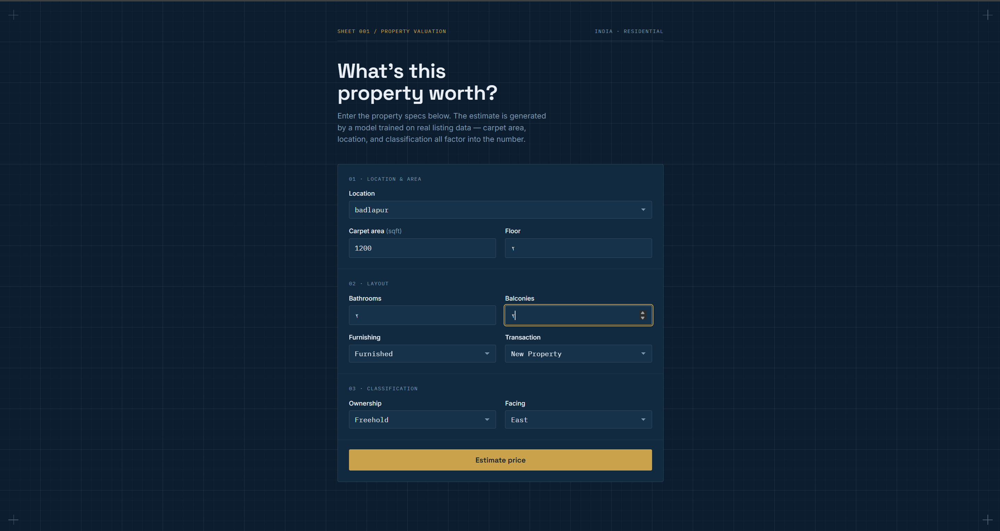
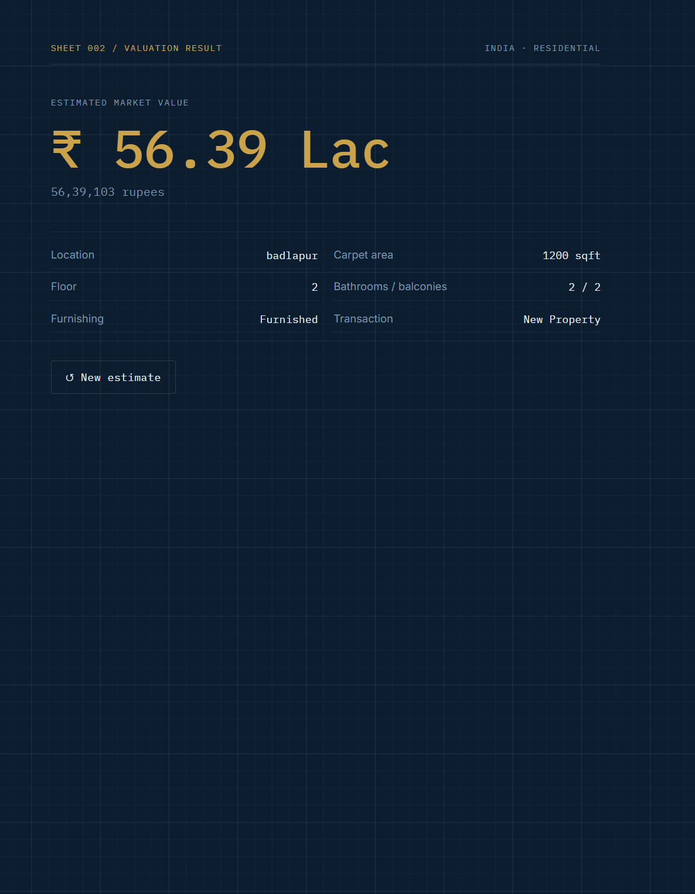

# House Price Prediction — End-to-End ML Web App

An end-to-end machine learning project that predicts house prices in India based on
property details (area, location, floor, furnishing, etc.). It includes a Jupyter
notebook for data cleaning and model training, a FastAPI backend that serves the
trained model, and a React + TypeScript frontend where users can enter property
details and get an instant price prediction.

## Overview

1. **Data & Modeling** — Raw listings from Kaggle are cleaned (price/area parsing,
   outlier removal, high-cardinality encoding) and used to train and compare
   multiple regression models. The best model is exported as a `.pkl` file.
2. **Backend (FastAPI)** — Loads the trained pipeline once at startup and exposes a
   `/predict` endpoint that returns a price prediction for a given property.
3. **Frontend (React + TypeScript + Vite)** — A form where users fill in property
   details and see the predicted price on a result page.

## Architecture

```
                 ┌────────────────────┐
                 │   Kaggle Dataset    │
                 │  (house_prices.csv) │
                 └──────────┬─────────┘
                            │
                            ▼
                 ┌────────────────────┐
                 │  Jupyter Notebook   │
                 │  clean → train →    │
                 │  evaluate → export  │
                 └──────────┬─────────┘
                            │  house_price.pkl
                            ▼
   ┌───────────────┐   HTTP    ┌────────────────────┐
   │ React Frontend│ ───────▶ │   FastAPI Backend    │
   │ (Vite, :5173) │ ◀─────── │   (:8000)            │
   └───────────────┘  JSON    └────────────────────┘
```

## Tech Stack

| Layer      | Technology                                                   |
|------------|---------------------------------------------------------------|
| Data / ML  | Python, pandas, numpy, scikit-learn, matplotlib, seaborn      |
| Backend    | FastAPI, Pydantic, Uvicorn, joblib                             |
| Frontend   | React, TypeScript, Vite, React Router                          |
| Tooling    | Jupyter Notebook, pytest, Git                                  |

## Project Structure

```
House_Price_Prediction_Project/
├── notebooks/
│   ├── data/                      # raw dataset (not committed, see below)
│   ├── house_price_model.ipynb    # cleaning, EDA, training, evaluation, export
│   ├── house_price.pkl            # exported trained pipeline
│   └── locations.json             # allowed locations for the frontend dropdown
├── backend/
│   ├── app/
│   │   ├── main.py                # FastAPI app, CORS, model loaded at startup
│   │   ├── api/routes/prediction.py  # GET /health, POST /predict
│   │   ├── core/config.py         # settings from .env
│   │   ├── schemas/prediction.py  # PredictionRequest / PredictionResponse
│   │   └── services/
│   │       ├── preprocessing.py   # request → one-row DataFrame
│   │       └── inference.py       # load .pkl, run predict
│   ├── models/house_price.pkl     # model served by the backend
│   ├── tests/test_prediction.py
│   ├── requirements.txt
│   └── .env.example
└── frontend/
    ├── src/
    │   ├── api/predictionClient.ts
    │   ├── components/PredictionForm.tsx
    │   ├── pages/HomePage.tsx | ResultPage.tsx | NotFoundPage.tsx
    │   └── types/prediction.ts
    └── .env.example
```

## Dataset

**House Price** by Juhi Bhojani —
https://www.kaggle.com/datasets/juhibhojani/house-price

Real property listings from India (~187,000 rows). The raw CSV is **not** committed
to this repository (it's ~100 MB). To get it:

```bash
pip install kaggle
# Get your API token: Kaggle → Settings → API → "Create New Token"
# Place kaggle.json in C:\Users\<you>\.kaggle\ (Windows) or ~/.kaggle/ (macOS/Linux)
kaggle datasets download -d juhibhojani/house-price -p notebooks/data --unzip
```

Or download it manually from the link above and place `house_prices.csv` in
`notebooks/data/`.

## Getting Started

### Prerequisites

- Python 3.11+
- Node.js 18+ and npm
- Git

### 1. Clone the repository

```bash
git clone https://github.com/zaid2658a-debug/house-price-prediction-app.git
cd house-price-prediction-app
```

### 2. Backend setup

```bash
cd backend
python -m venv .venv
.venv\Scripts\activate        # Windows
# source .venv/bin/activate   # macOS / Linux

pip install -r requirements.txt
copy .env.example .env        # Windows
# cp .env.example .env        # macOS / Linux

uvicorn app.main:app --reload
```

The API will be available at `http://localhost:8000` (interactive docs at
`http://localhost:8000/docs`).

### 3. Frontend setup

```bash
cd frontend
npm install
copy .env.example .env        # Windows
# cp .env.example .env        # macOS / Linux

npm run dev
```

The app will be available at `http://localhost:5173`.

### 4. (Optional) Retrain the model

```bash
cd notebooks
jupyter notebook house_price_model.ipynb
# Run all cells (Kernel → Restart & Run All)
```

This regenerates `house_price.pkl` and `locations.json`. Copy the updated `.pkl`
into `backend/models/` to serve the new model.

## Environment Variables

**Backend (`backend/.env`)**

| Variable         | Description                              | Example                          |
|-------------------|-------------------------------------------|-----------------------------------|
| `MODEL_PATH`      | Path to the trained model pickle          | `models/house_price.pkl`         |
| `LOCATIONS_PATH`  | Path to the allowed-locations JSON file   | `models/locations.json`          |
| `CORS_ORIGINS`    | Allowed frontend origin(s)                | `["http://localhost:5173"]`      |

**Frontend (`frontend/.env`)**

| Variable               | Description               | Example                     |
|-------------------------|----------------------------|-------------------------------|
| `VITE_API_BASE_URL`     | Base URL of the backend API| `http://localhost:8000`      |

## API Reference

### `GET /health`

Returns the backend's health status.

```json
{ "status": "ok" }
```

### `POST /predict`

Predicts a house price from property details.

**Request body:**

```json
{
  "carpet_area_sqft": 1200,
  "floor_num": 3,
  "bathroom": 2,
  "balcony": 1,
  "location": "Mumbai",
  "furnishing": "Semi-Furnished",
  "transaction": "Resale",
  "ownership": "Freehold",
  "facing": "East"
}
```

**Response:**

```json
{ "predicted_price": 4250000.0 }
```

**curl example:**

```bash
curl -X POST http://localhost:8000/predict \
  -H "Content-Type: application/json" \
  -d '{
    "carpet_area_sqft": 1200,
    "floor_num": 3,
    "bathroom": 2,
    "balcony": 1,
    "location": "Mumbai",
    "furnishing": "Semi-Furnished",
    "transaction": "Resale",
    "ownership": "Freehold",
    "facing": "East"
  }'
```

## Model Performance

Three regression models were trained and evaluated on a held-out test set
(80/20 split). The model was trained on `log1p(price)` and predictions are
converted back with `expm1()` before being returned by the API.

| Model              | MAE            | RMSE           | R²        |
|---------------------|----------------|----------------|-----------|
| **Random Forest** ✅ | **1,138,027**  | **5,628,171**  | **0.830** |
| Gradient Boosting    | 2,987,291      | 7,411,947      | 0.706     |
| Linear Regression    | 16,284,600     | 1,241,205,000  | -8249.49  |

**Random Forest** was selected as the final model: it has the lowest error (MAE and
RMSE) and by far the best R² (0.83, meaning it explains ~83% of the variance in
price), while Linear Regression performs extremely poorly because the
price/feature relationships in this dataset are highly non-linear.

## Screenshots

*(Add screenshots of the running app here, e.g. the form page and the result page.)*

```


```

## License

This project was built as part of a student assignment and is provided as-is for
educational purposes.
